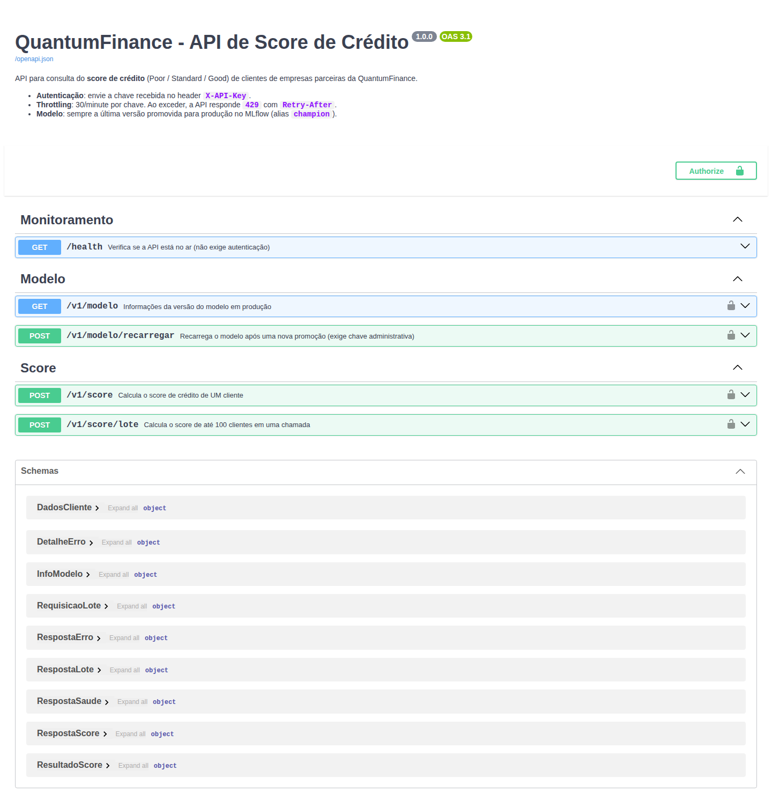
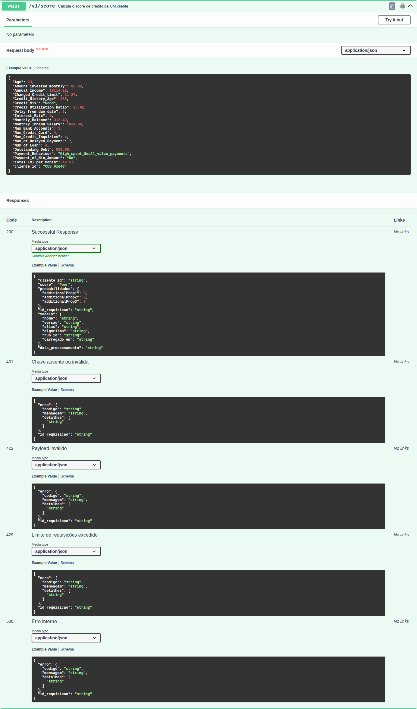
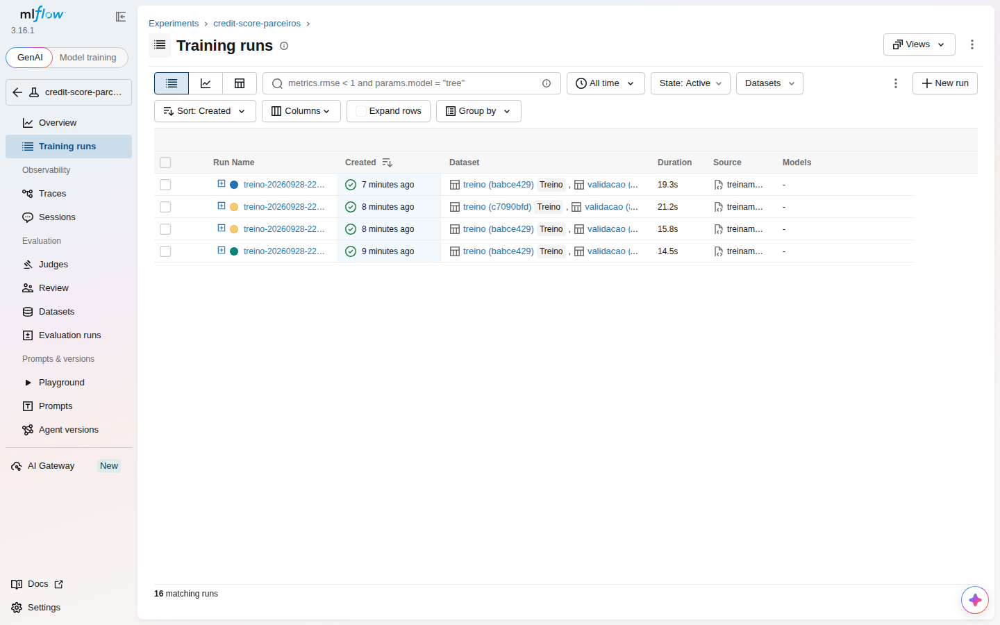
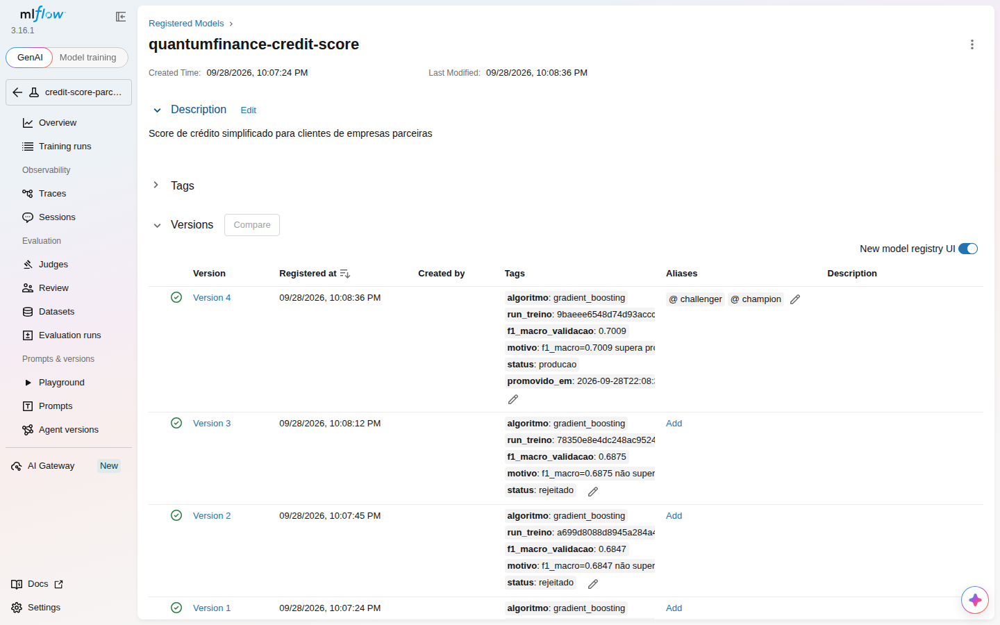

# Documentação da API de Score de Crédito — QuantumFinance

**Versão da API:** 1.0.0  **Formato:** REST/JSON (UTF-8)  **Modelo servido:** `quantumfinance-credit-score@champion` (MLflow Model Registry)

A API devolve o **score de crédito** (`Poor`, `Standard` ou `Good`) de clientes das empresas
parceiras, com a probabilidade de cada classe e a versão do modelo que gerou o resultado.

Sumário

1. [Endpoints de acesso](#1-endpoints-de-acesso)
2. [Como fazer a chamada](#2-como-fazer-a-chamada)
3. [Respostas possíveis (sucesso e erros)](#3-respostas-possíveis)
4. [Troubleshooting / FAQ](#4-troubleshooting--faq)
5. [Deploy: como ligar e usar o servidor local](#5-deploy-como-ligar-e-usar-o-servidor-local)

---

## 1. Endpoints de acesso

URL base (servidor local): **`http://localhost:8000`**

| Método | Caminho | Autenticação | Throttling | Descrição |
|---|---|---|---|---|
| `POST` | `/v1/score` | `X-API-Key` | 30/min por chave | Score de **um** cliente |
| `POST` | `/v1/score/lote` | `X-API-Key` | 30/min por chave | Score de **até 100** clientes em uma chamada |
| `GET` | `/v1/modelo` | `X-API-Key` | 30/min por chave | Versão do modelo em produção |
| `POST` | `/v1/modelo/recarregar` | `X-API-Key` **admin** | 5/min | Recarrega o modelo após uma nova promoção |
| `GET` | `/health` | nenhuma | — | Verificação de saúde (monitoramento / load balancer) |
| `GET` | `/docs` | nenhuma | — | Documentação interativa (Swagger UI), permite testar as chamadas |
| `GET` | `/redoc` | nenhuma | — | Documentação de referência (ReDoc) |
| `GET` | `/openapi.json` | nenhuma | — | Contrato OpenAPI 3 (para gerar clientes automaticamente) |



---

## 2. Como fazer a chamada

### 2.1 Headers

| Header | Obrigatório | Valor | Observação |
|---|---|---|---|
| `X-API-Key` | Sim (exceto `/health`) | chave fornecida pela QuantumFinance | Identifica o parceiro e define a cota de throttling |
| `Content-Type` | Sim nos `POST` | `application/json` | |
| `X-Request-ID` | Não | texto livre (ex.: UUID) | Se enviado, é devolvido na resposta; se não, a API gera um. Use-o ao abrir chamados |

### 2.2 Autenticação

- Formato: **chave de API estática no header `X-API-Key`** (`X-API-Key: <sua-chave>`).
- Não usar query string (`?key=`): a chave ficaria em logs de proxies e no histórico do navegador.
- Cada parceiro recebe uma chave própria; a revogação é feita removendo-a de `QF_API_KEYS`
  e reiniciando a API.
- Existem dois perfis: **parceiro** (`QF_API_KEYS`, endpoints de score e consulta) e
  **administrador** (`QF_ADMIN_KEYS`, também pode recarregar o modelo).
- A comparação da chave é feita em tempo constante (`secrets.compare_digest`), o que evita ataques de tempo.

### 2.3 Throttling (limite de requisições)

- Padrão: **30 requisições por minuto, por chave de API e por endpoint** (configurável em
  `config/config.yaml → api.limite_requisicoes` ou na variável `QF_RATE_LIMIT`).
- Toda resposta dos endpoints limitados traz os headers:

| Header | Significado |
|---|---|
| `X-RateLimit-Limit` | Limite da janela (ex.: `30`) |
| `X-RateLimit-Remaining` | Chamadas restantes na janela atual |
| `X-RateLimit-Reset` | Momento (epoch, segundos) em que a janela reinicia |
| `Retry-After` | Segundos a aguardar antes de tentar de novo |

- Ao exceder, a API responde **`429 Too Many Requests`**.
- Para muitos clientes, prefira **`/v1/score/lote`**: 100 clientes contam como **uma** requisição.

### 2.4 Payload de `POST /v1/score`

Corpo JSON com os dados do **mês mais recente** do cliente. Todos os campos são obrigatórios,
exceto `cliente_id`. Campos não listados são **rejeitados** (por exemplo, `SSN` ou `Name`:
a API não aceita dados pessoais que o modelo não usa).

| Campo | Tipo | Faixa aceita | Descrição |
|---|---|---|---|
| `cliente_id` | string (≤ 64) ou null | — | Opcional. Identificador do cliente no parceiro; apenas devolvido na resposta |
| `Age` | inteiro | 14 – 100 | Idade (anos) |
| `Annual_Income` | número | 0 – 250.000 | Renda anual |
| `Monthly_Inhand_Salary` | número | 0 – 25.000 | Salário líquido mensal |
| `Num_Bank_Accounts` | inteiro | 0 – 20 | Nº de contas bancárias |
| `Num_Credit_Card` | inteiro | 0 – 15 | Nº de cartões de crédito |
| `Interest_Rate` | número | 0 – 40 | Taxa de juros média (%) |
| `Num_of_Loan` | inteiro | 0 – 15 | Nº de empréstimos |
| `Delay_from_due_date` | inteiro | -10 – 100 | Dias médios de atraso em relação ao vencimento |
| `Num_of_Delayed_Payment` | inteiro | 0 – 40 | Nº de pagamentos atrasados |
| `Changed_Credit_Limit` | número | -50 – 50 | Variação do limite de crédito (%) |
| `Num_Credit_Inquiries` | inteiro | 0 – 30 | Nº de consultas de crédito |
| `Outstanding_Debt` | número | 0 – 10.000 | Dívida em aberto |
| `Credit_Utilization_Ratio` | número | 0 – 100 | Utilização do crédito (%) |
| `Credit_History_Age` | inteiro | 0 – 600 | Idade do histórico de crédito **em meses** (ex.: "22 anos e 1 mês" = 265) |
| `Total_EMI_per_month` | número | 0 – 5.000 | Total de parcelas mensais |
| `Amount_invested_monthly` | número | 0 – 9.999 | Valor investido por mês |
| `Monthly_Balance` | número | -5.000 – 5.000 | Saldo mensal |
| `Credit_Mix` | enum | `Bad`, `Standard`, `Good` | Qualidade do mix de crédito |
| `Payment_of_Min_Amount` | enum | `Yes`, `No`, `NM` | Paga apenas o mínimo? (`NM` = não mensurado) |
| `Payment_Behaviour` | enum | `Low_spent_Small_value_payments`, `Low_spent_Medium_value_payments`, `Low_spent_Large_value_payments`, `High_spent_Small_value_payments`, `High_spent_Medium_value_payments`, `High_spent_Large_value_payments` | Perfil de gastos e pagamentos |

Os nomes dos campos são os mesmos do dataset de origem, para facilitar a integração com
os sistemas que já produzem esses dados.

**Exemplo de requisição**

```bash
curl -X POST http://localhost:8000/v1/score \
  -H "X-API-Key: <sua-chave>" \
  -H "Content-Type: application/json" \
  -d '{
    "cliente_id": "CUS_0xd40",
    "Age": 23, "Annual_Income": 19114.12, "Monthly_Inhand_Salary": 1824.84,
    "Num_Bank_Accounts": 3, "Num_Credit_Card": 4, "Interest_Rate": 3, "Num_of_Loan": 4,
    "Delay_from_due_date": 3, "Num_of_Delayed_Payment": 7, "Changed_Credit_Limit": 11.27,
    "Num_Credit_Inquiries": 4, "Outstanding_Debt": 809.98, "Credit_Utilization_Ratio": 26.82,
    "Credit_History_Age": 265, "Total_EMI_per_month": 49.57, "Amount_invested_monthly": 80.42,
    "Monthly_Balance": 312.49, "Credit_Mix": "Good", "Payment_of_Min_Amount": "No",
    "Payment_Behaviour": "High_spent_Small_value_payments"
  }'
```

**Exemplo em Python**

```python
import requests

resp = requests.post(
    "http://localhost:8000/v1/score",
    headers={"X-API-Key": "<sua-chave>"},
    json=cliente,          # dicionário com os campos da tabela acima
    timeout=10,
)
if resp.status_code == 429:
    espera = int(resp.headers["Retry-After"])   # aguarde e tente de novo
resp.raise_for_status()
print(resp.json()["score"], resp.json()["probabilidades"])
```

### 2.5 Payload de `POST /v1/score/lote`

```json
{ "clientes": [ { ...cliente 1... }, { ...cliente 2... } ] }
```

- Entre 1 e 100 clientes por chamada (`api.limite_lote`).
- Cada item segue exatamente o schema da seção 2.4.
- Se **qualquer** item for inválido, a chamada inteira retorna `422`, e o campo
  `detalhes[].campo` indica o índice (ex.: `clientes.3.Age`).

### 2.6 `GET /v1/modelo`, `POST /v1/modelo/recarregar` e `GET /health`

Não têm corpo. Basta o header `X-API-Key` (exceto em `/health`).



---

## 3. Respostas possíveis

### 3.1 Sucesso

**`200 OK` em `POST /v1/score`**

```json
{
  "cliente_id": "CUS_0xd40",
  "score": "Good",
  "probabilidades": { "Good": 0.9323, "Poor": 0.017, "Standard": 0.0507 },
  "id_requisicao": "74c99a1e-eb28-4ba3-beba-f35bbd214169",
  "modelo": {
    "nome": "quantumfinance-credit-score",
    "versao": "4",
    "alias": "champion",
    "algoritmo": "gradient_boosting",
    "run_id": "24a3376692c84f48b4982ddba2355da6",
    "carregado_em": "2026-09-28T22:08:59+00:00"
  },
  "data_processamento": "2026-09-28T22:09:28+00:00"
}
```

| Campo | Tipo | Descrição |
|---|---|---|
| `score` | `Poor` \| `Standard` \| `Good` | Classe de maior probabilidade |
| `probabilidades` | objeto {classe: número 0–1} | Probabilidade de cada classe; a soma é 1 |
| `cliente_id` | string ou null | O mesmo valor enviado |
| `id_requisicao` | string | Mesmo valor do header de resposta `X-Request-ID` |
| `modelo.versao` | string | Versão do Model Registry que calculou o score (auditoria) |
| `modelo.run_id` | string | Run do MLflow que treinou essa versão (linhagem completa) |
| `data_processamento` | string ISO-8601 UTC | Momento do cálculo |

**`200 OK` em `POST /v1/score/lote`**

```json
{
  "id_requisicao": "f9f0db8d-2607-47d5-8ae5-170ea8af9344",
  "total": 2,
  "resultados": [
    { "cliente_id": "CUS_0xd40",  "score": "Good", "probabilidades": { "Good": 0.9323, "Poor": 0.017,  "Standard": 0.0507 } },
    { "cliente_id": "CUS_0x21b1", "score": "Poor", "probabilidades": { "Good": 0.0034, "Poor": 0.5779, "Standard": 0.4186 } }
  ],
  "modelo": { "nome": "quantumfinance-credit-score", "versao": "4", "alias": "champion", "...": "..." },
  "data_processamento": "2026-09-28T22:09:28+00:00"
}
```

Os resultados saem **na mesma ordem** dos clientes enviados.

**`200 OK` em `GET /v1/modelo` e `POST /v1/modelo/recarregar`**: o mesmo objeto `modelo` acima.

**`200 OK` em `GET /health`**

```json
{ "status": "ok", "modelo_carregado": true, "versao_modelo": "4" }
```

`status` = `degradado` e `modelo_carregado` = `false` indicam que a API está no ar, mas sem modelo (as chamadas de score retornam `503`).

### 3.2 Erros

Todos os erros têm o **mesmo formato**:

```json
{
  "erro": { "codigo": "<código_estável>", "mensagem": "<texto para humanos>", "detalhes": null },
  "id_requisicao": "0f9a6422-59d8-4719-997b-23227f65e55d"
}
```

Os sistemas integradores devem tratar o erro pelo **HTTP status + `erro.codigo`**. O texto de `mensagem` pode mudar.

| HTTP | `erro.codigo` | Quando acontece | Exemplo de `mensagem` |
|---|---|---|---|
| 401 | `chave_ausente` | Header `X-API-Key` não enviado | `Header X-API-Key não informado.` |
| 401 | `chave_invalida` | Chave errada, com espaços extras ou revogada | `Chave de API inválida ou revogada.` |
| 403 | `acesso_negado` | Chave de parceiro em endpoint administrativo | `Esta operação exige chave administrativa.` |
| 404 | `rota_inexistente` | URL errada (ex.: `/v2/score`, `/score`) | `Rota /v2/score não encontrada.` |
| 405 | `metodo_nao_permitido` | Método errado (ex.: `GET /v1/score`) | `Método GET não permitido em /v1/score.` |
| 413 | `lote_muito_grande` | Mais de 100 clientes no lote | `Máximo de 100 clientes por chamada; recebidos 101.` |
| 422 | `payload_invalido` | JSON malformado, campo faltando, fora da faixa, enum inválido ou campo desconhecido | `Um ou mais campos são inválidos.` |
| 429 | `limite_excedido` | Cota de throttling esgotada | `Limite de requisições excedido (30 per 1 minute)...` |
| 500 | `erro_interno` | Falha inesperada | `Erro interno. Informe o X-Request-ID ao suporte.` |
| 503 | `modelo_indisponivel` | Não há modelo em produção carregado | `Nenhum modelo em produção carregado...` |

**Exemplo de `422` (lista cada campo com problema)**

```json
{
  "erro": {
    "codigo": "payload_invalido",
    "mensagem": "Um ou mais campos são inválidos.",
    "detalhes": [
      { "campo": "Age",        "problema": "Input should be less than or equal to 100" },
      { "campo": "Credit_Mix", "problema": "Input should be 'Bad', 'Standard' or 'Good'" },
      { "campo": "Annual_Income", "problema": "Field required" }
    ]
  },
  "id_requisicao": "61b71e7b-fbdd-4fba-b23c-081ecba55b40"
}
```

JSON malformado devolve `detalhes: [{"campo": "corpo", "problema": "JSON decode error"}]`.

**Exemplo de `429`**

```
HTTP/1.1 429 Too Many Requests
x-ratelimit-limit: 30
x-ratelimit-remaining: 0
retry-after: 60
```
```json
{ "erro": { "codigo": "limite_excedido", "mensagem": "Limite de requisições excedido (30 per 1 minute). Aguarde e tente novamente.", "detalhes": null }, "id_requisicao": "f7710df0-..." }
```

A saída real de todas essas chamadas, obtida com o servidor ligado, está em
[`evidencias/07_chamadas_api.txt`](evidencias/07_chamadas_api.txt) e pode ser reproduzida com
`scripts/exemplos_chamadas.sh`.

---

## 4. Troubleshooting / FAQ

| Sintoma | Causa provável | Solução |
|---|---|---|
| `401 chave_ausente` | Header não enviado ou com nome errado (`Authorization`, `api_key`, `X-Api-Token`) | Envie exatamente `X-API-Key: <chave>` (o nome do header não diferencia maiúsculas) |
| `401 chave_invalida` com a chave "certa" | Espaço ou quebra de linha copiados junto; chave de outro ambiente; chave revogada | Confira com `echo -n "$CHAVE" \| wc -c`; peça nova chave ao time da QuantumFinance |
| Toda chave é recusada logo após subir a API | `QF_API_KEYS` não foi exportada no terminal que iniciou o servidor | `export QF_API_KEYS=...` (ou `make api`, que lê o `.env`) e reinicie o servidor |
| `403 acesso_negado` em `/v1/modelo/recarregar` | Chave de parceiro | Use uma chave de `QF_ADMIN_KEYS` |
| `422` com `"problema": "Field required"` | Faltou um campo obrigatório | Envie os 20 campos da seção 2.4; só `cliente_id` é opcional |
| `422` com `Extra inputs are not permitted` | Campo que não existe no contrato (ex.: `SSN`, `Name`, `Month`) | Remova o campo; a API rejeita dados pessoais que não usa |
| `422` em `Credit_History_Age` | Envio no formato texto `"22 Years and 1 Months"` | Converta para meses: 22×12+1 = `265` |
| `422` em `Credit_Mix` / `Payment_Behaviour` | Valor traduzido, com erro de digitação ou sentinela do dataset (`_`, `!@9#%8`) | Use exatamente os valores do enum, que diferenciam maiúsculas |
| `422` com `JSON decode error` | JSON malformado: aspas simples, vírgula sobrando, chaves sem aspas | Valide o corpo (ex.: `python -m json.tool`). No Windows/PowerShell, prefira `--data @arquivo.json` |
| `413 lote_muito_grande` | Mais de 100 clientes | Divida em blocos de até 100 |
| `429 limite_excedido` | Mais de 30 chamadas/min com a mesma chave | Respeite `Retry-After`, use backoff exponencial e **agrupe clientes em `/v1/score/lote`** |
| `503 modelo_indisponivel` / `/health` = `degradado` | Não há versão com alias `champion` ou o `mlflow.db` não foi encontrado | Rode `python src/treinamento.py` e depois `POST /v1/modelo/recarregar` (admin) ou reinicie a API. Confira `MLFLOW_TRACKING_URI` |
| API respondendo com a versão antiga depois de um retreino | O modelo é carregado em memória na inicialização | `POST /v1/modelo/recarregar` com chave admin, ou reinicie. Confira em `GET /v1/modelo` |
| `Connection refused` | Servidor desligado ou em outra porta | Suba com `make api`; verifique `curl http://localhost:8000/health` |
| `Address already in use` ao iniciar | Porta 8000 ocupada | `uvicorn api.main:app --port 8001` ou encerre o processo (`lsof -i :8000`) |
| Erro ao carregar o modelo: `UntrustedTypesFoundException` | Modelo salvo em formato skops com um tipo não autorizado | Adicione o tipo, depois de revisá-lo, a `TIPOS_CONFIAVEIS` em `src/treinamento.py` e treine novamente |
| `ModuleNotFoundError: credit_score` | Servidor iniciado fora da raiz do projeto | Execute a partir da raiz: `uvicorn api.main:app` |
| Swagger (`/docs`) em branco | O navegador não acessa o CDN do Swagger UI (rede corporativa) | Use `/redoc` ou `/openapi.json` (importável no Postman/Insomnia) |
| `500 erro_interno` | Falha inesperada | Envie o `X-Request-ID` ao suporte; o log do servidor registra a stack trace com esse ID |

**Perguntas frequentes**

- **O score muda se eu chamar duas vezes com os mesmos dados?** Não. O modelo é
  determinístico para a mesma versão. Ele só muda quando uma nova versão é promovida
  (confira `modelo.versao`).
- **Qual mês de dados devo enviar?** O mês mais recente disponível do cliente. O modelo foi
  treinado com os meses mais recentes do histórico.
- **Como sei qual versão gerou um score antigo?** Guarde `modelo.versao` e `id_requisicao`.
  No MLflow, a versão leva ao run de treino, às métricas e ao hash do dataset.
- **A API guarda os dados enviados?** Não. O payload não é persistido nem registrado em log;
  o log guarda apenas método, rota, status, latência e `X-Request-ID`.
- **O throttling vale para várias réplicas?** Com `QF_RATE_LIMIT_STORAGE=memory://` o
  contador é por processo. Com várias réplicas, use Redis (`redis://host:6379`).

---

## 5. Deploy: como ligar e usar o servidor local

O deploy desta entrega é **local**, com Uvicorn (servidor ASGI) servindo a aplicação FastAPI.
O modelo é lido do MLflow Model Registry local (`mlflow.db` + `mlartifacts/`).
Foi validado em Linux com Python 3.11. No Windows, troque `source .venv/bin/activate` por `.venv\Scripts\activate`.

### Passo 1: preparar o ambiente

```bash
cd quantumfinance-credit-score
python -m venv .venv
source .venv/bin/activate
pip install -r requirements-dev.txt
```

### Passo 2: treinar e promover um modelo (cria o `champion`)

```bash
python src/treinamento.py
# [promoção] APROVADA: v1 agora é 'champion' (anterior: nenhuma)
```

### Passo 3: configurar as chaves de API

```bash
cp .env.example .env
python -c "import secrets; print(secrets.token_urlsafe(32))"   # gere uma chave forte
# edite .env: QF_API_KEYS=<chave-parceiro>  QF_ADMIN_KEYS=<chave-admin>
```

### Passo 4: ligar o servidor

```bash
make api
# equivalente a:
set -a && . ./.env && set +a
uvicorn api.main:app --host 0.0.0.0 --port 8000
```

Saída esperada:

```
INFO qf.api modelo carregado: quantumfinance-credit-score v4 (gradient_boosting)
INFO:     Uvicorn running on http://0.0.0.0:8000
```

### Passo 5: testar

```bash
curl http://localhost:8000/health
# {"status":"ok","modelo_carregado":true,"versao_modelo":"4"}

API_KEY=<chave-parceiro> ADMIN_KEY=<chave-admin> ./scripts/exemplos_chamadas.sh   # todas as chamadas de exemplo
python -m pytest -q tests                                                           # 12 testes automatizados
```

Ou abra **http://localhost:8000/docs**, clique em **Authorize**, informe a chave e use **Try it out**.

### Passo 6 (opcional): acompanhar experimentos e versões no MLflow

```bash
make mlflow-ui       # http://localhost:5000
```




### Atualizar o modelo em produção sem derrubar a API

```bash
python src/treinamento.py                        # se aprovado, move o alias champion
curl -X POST http://localhost:8000/v1/modelo/recarregar -H "X-API-Key: <chave-admin>"
```

A troca é atômica: as requisições em andamento terminam com o modelo anterior.
Rollback: `python src/promover_modelo.py --versao <N> --motivo "..."` e, em seguida, recarregar.

### Alternativa com Docker

Os arquivos `Dockerfile` e `docker-compose.yml` estão prontos: `docker compose run --rm api python src/treinamento.py` e depois `docker compose up -d` (API na porta 8000, MLflow na 5000).
*Observação: o caminho com Docker não foi executado no ambiente desta entrega (não havia daemon Docker disponível). O deploy validado é o local, com Uvicorn, descrito acima.*

### Deploy na nuvem (Google Cloud Run)

O passo a passo do deploy automático via GitHub Actions está em [`DEPLOY_GCP.md`](DEPLOY_GCP.md). Na nuvem, a URL base passa a ser a do serviço Cloud Run (`https://api-score-credito-<hash>-rj.a.run.app`), com HTTPS automático. Headers, payloads e respostas não mudam.

### Recomendações para produção (fora do escopo local)

- Publicar atrás de **HTTPS** (Nginx/Traefik ou API Gateway). Em HTTP, a chave trafega em texto claro.
- Guardar as chaves em um cofre (AWS Secrets Manager, Azure Key Vault ou HashiCorp Vault), com rotação periódica.
- Throttling com Redis compartilhado entre réplicas; WAF para limitar tentativas de chaves inválidas por IP.
- Servidor MLflow central (`MLFLOW_TRACKING_URI`) com banco PostgreSQL e artefatos em bucket (S3/GCS/Azure Blob).
