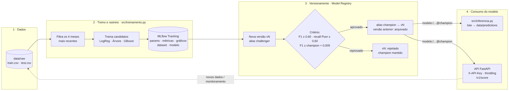

# Template do repositório e ciclo de vida do modelo

Este documento descreve como os arquivos e diretórios do projeto **QuantumFinance: Score de
Crédito para Parceiros** ficam organizados para manter todo o ciclo de vida do modelo
(dados → experimento → versão → produção → monitoramento → retreino).



## 1. Árvore de diretórios

```text
quantumfinance-credit-score/
├── README.md                         # visão geral e guia rápido (comece por aqui)
├── requirements.txt                  # dependências de execução (versões fixadas)
├── requirements-dev.txt              # + dependências de teste
├── Makefile                          # atalhos: make treinar | inferir | api | mlflow-ui | testar
├── .env.example                      # modelo de variáveis de ambiente (chaves, limites); o .env real não é versionado
├── .gitignore                        # impede versionar dados, segredos e artefatos gerados
├── Dockerfile                        # imagem da API
├── docker-compose.yml                # API + interface do MLflow
│
├── .dockerignore
├── .github/workflows/ci-cd.yml       # CI/CD: testes em todo push/PR; na main, build, deploy no Cloud Run e tag de versão
├── deploy/gcp/
│   ├── Dockerfile                    # imagem do Cloud Run (treina o modelo no build)
│   └── configurar_gcp.sh             # configuração única do GCP (Artifact Registry, WIF, Secret Manager)
│
├── config/
│   ├── config.yaml                   # FONTE ÚNICA de parâmetros: dados, janela temporal, MLflow,
│   │                                 # hiperparâmetros, critérios de promoção, limites da API
│   └── experimentos/
│       └── gb_ajustado.yaml          # variações de configuração para novos experimentos
│
├── data/                             # dados (data/raw versionado aqui; em produção, DVC ou bucket)
│   ├── raw/                          # dados brutos, imutáveis
│   │   ├── train.csv                 # histórico rotulado (jan–ago)
│   │   └── test.csv                  # dados sem rótulo para inferência (set–dez)
│   ├── processed/                    # dados intermediários (se necessário)
│   └── predictions/                  # saídas da inferência em lote, versionadas pelo nome
│                                     # (predicoes_v<versão>_<data>.csv)
│
├── notebooks/
│   ├── 01_analise_exploratoria.ipynb # EDA; apenas exploração, nenhuma regra de produção
│   └── 02_avaliacao_api_colab.ipynb  # Colab: chama a API no Cloud Run e mede a qualidade com dados rotulados
│
├── src/                              # código de produção
│   ├── credit_score/                 # pacote compartilhado (treino, inferência e API)
│   │   ├── config.py                 # leitura do config.yaml e resolução da URI do MLflow
│   │   └── processamento.py          # limpeza + features + pré-processador (evita divergência treino/produção)
│   ├── treinamento.py                # ENTREGÁVEL 2: treino, rastreio, critério e promoção
│   ├── inferencia.py                 # ENTREGÁVEL 3: inferência com a última versão promovida
│   └── promover_modelo.py            # governança: listar versões, promoção manual e rollback
│
├── api/                              # serviço REST (FastAPI)
│   ├── main.py                       # endpoints, carga do modelo, erros padronizados
│   ├── seguranca.py                  # autenticação X-API-Key + throttling (slowapi)
│   └── esquemas.py                   # contratos de entrada/saída (Pydantic → OpenAPI)
│
├── tests/                            # testes automatizados (pytest)
│   ├── test_processamento.py         # limpeza de dados
│   └── test_api.py                   # autenticação, validação, throttling, respostas
│
├── scripts/
│   └── exemplos_chamadas.sh          # exemplos de chamadas à API (sucesso e erros)
│
├── models/                           # exportações locais opcionais do modelo (ex.: para deploy offline).
│                                     # O registro oficial das versões é o MLflow Model Registry
│
├── docs/
│   ├── ESTRUTURA_REPOSITORIO.md      # ENTREGÁVEL 1: este documento
│   ├── API.md                        # ENTREGÁVEL 4: documentação da API
│   ├── DEPLOY_GCP.md                 # deploy no Google Cloud com CI/CD
│   ├── imagens/                      # diagramas e capturas de tela (Swagger, MLflow)
│   └── evidencias/                   # logs reais das execuções (treinos, promoções, inferência, API)
│
├── mlflow.db                         # (gerado) backend do MLflow: runs, métricas, params, registry
└── mlartifacts/                      # (gerado) artefatos do MLflow: modelos, gráficos, relatórios
```

## 2. Por que essa organização

| Princípio | Como aparece no repositório |
|---|---|
| **Separação entre exploração e produção** | `notebooks/` só explora; o código que roda em produção fica em `src/` e `api/` |
| **Uma fonte de verdade para transformações** | `src/credit_score/processamento.py` é importado pelo treino e embutido no pipeline do modelo; inferência e API usam exatamente a mesma limpeza |
| **Configuração fora do código** | `config/config.yaml`: mudar a janela de meses, os hiperparâmetros ou o critério de promoção não exige alterar código |
| **Segredos fora do Git** | chaves em variáveis de ambiente (`.env` no `.gitignore`); só o `.env.example` é versionado |
| **Dados imutáveis e fora do Git** | `data/raw` não é alterado; o hash SHA-256 do arquivo é registrado em cada run (linhagem) |
| **Modelo versionado no registry, não em pasta** | versões v1, v2, ... e aliases `champion`/`challenger` no MLflow; nenhum código aponta para um arquivo `.pkl` fixo |
| **Reprodutibilidade** | versões fixadas em `requirements.txt`, semente fixa, config usada salva como artefato do run |
| **Automação** | `Makefile` para o dia a dia; `ci-cd.yml` para testes, retreino e deploy no Cloud Run; `Dockerfile` para empacotar a API |

## 3. Ciclo de vida: quem produz e quem consome cada artefato

| Etapa | Script / componente | Lê | Produz |
|---|---|---|---|
| 1. Exploração | `notebooks/01_analise_exploratoria.ipynb` | `data/raw/train.csv` | decisões registradas em `processamento.py` e `config.yaml` |
| 2. Treino e rastreio | `src/treinamento.py` | `config.yaml`, `data/raw/train.csv` | runs no MLflow (params, métricas, gráficos, modelo) |
| 3. Versionamento | `src/treinamento.py` | melhor run | nova versão no Model Registry + alias `challenger` |
| 4. Avaliação e promoção | `src/treinamento.py` (ou `promover_modelo.py`, manual) | candidato × `champion` na mesma validação | alias `champion` movido (ou versão marcada como `rejeitado`) |
| 5. Inferência em lote | `src/inferencia.py` | `models:/quantumfinance-credit-score@champion`, `data/raw/test.csv` | `data/predictions/predicoes_v<N>_<data>.csv` |
| 6. Inferência online | `api/main.py` | `models:/...@champion` | respostas JSON com versão do modelo e `X-Request-ID` |
| 7. Retreino e deploy | CI/CD (`ci-cd.yml`, push na main ou `workflow_dispatch`) | novos dados em `data/raw` | volta à etapa 2 |

## 4. Convenções

- **Nome do modelo registrado:** `quantumfinance-credit-score`
- **Aliases:** `champion` = produção; `challenger` = último candidato avaliado
- **Tags de versão:** `status` (`producao` | `arquivado` | `rejeitado`), `motivo`, `algoritmo`, `run_treino`, `f1_macro_validacao`, `promovido_em`
- **Runs:** `treino-AAAAMMDD-HHMMSS` (pai) com um run filho por algoritmo candidato
- **Predições:** `predicoes_v<versão>_<AAAAMMDD_HHMMSS>.csv`, sempre com a coluna `versao_modelo`
- **API:** versionada no caminho (`/v1/...`); uma mudança incompatível no contrato vira `/v2`
