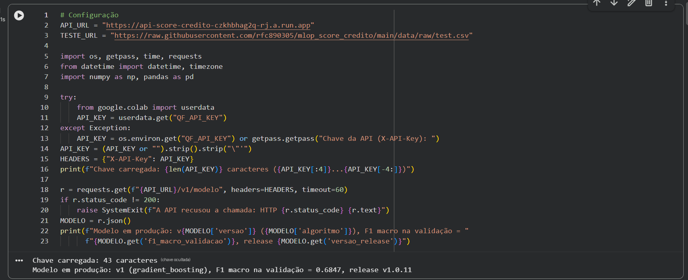
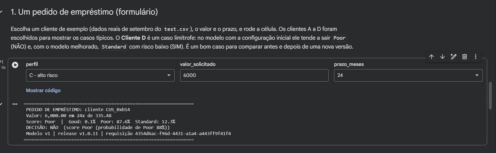
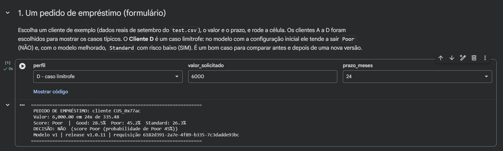
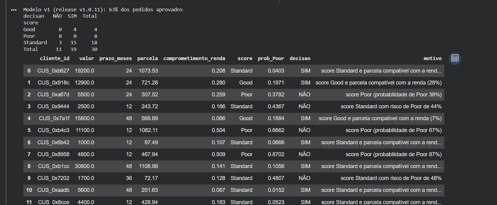
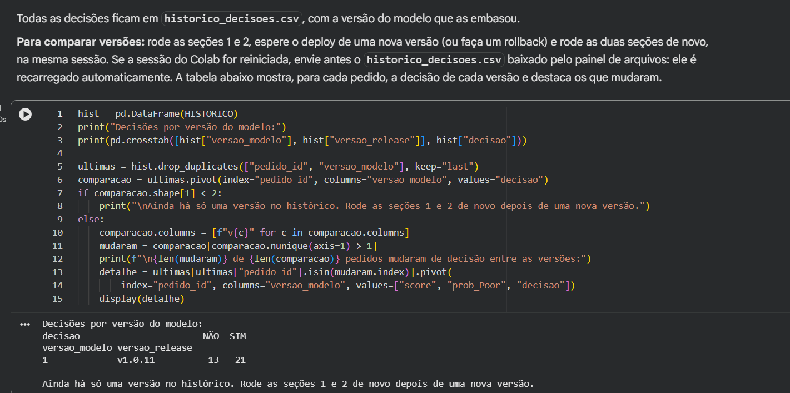
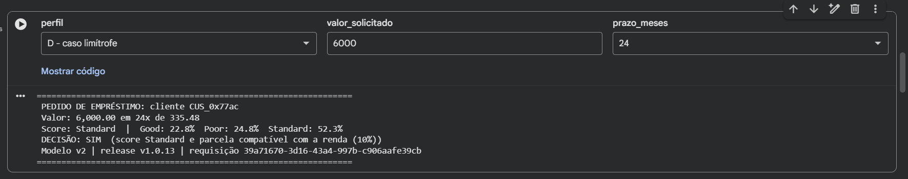
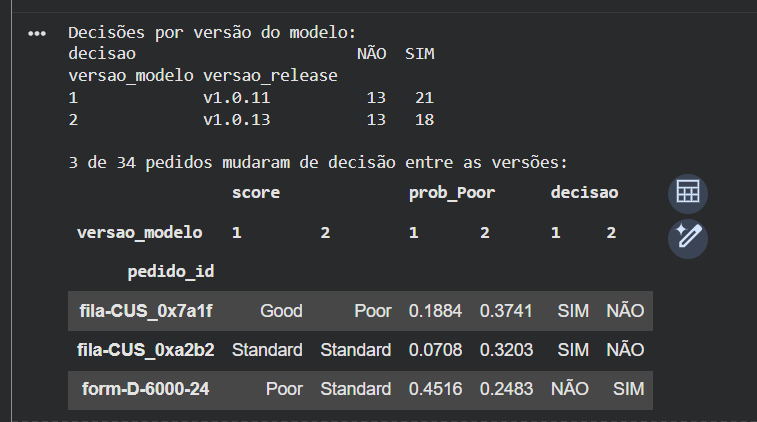

# Evidências do ciclo de MLOps em produção

Execução real, em 29/09/2026, do roteiro descrito em [`CICLO_NOVA_VERSAO.md`](CICLO_NOVA_VERSAO.md), no ambiente
publicado (GitHub Actions + Cloud Storage + Cloud Run). A aplicação cliente é o notebook
[`03_aplicacao_emprestimo_colab.ipynb`](../notebooks/03_aplicacao_emprestimo_colab.ipynb), rodado no Google Colab
contra a API `https://api-score-credito-czkhbhag2q-rj.a.run.app`.

## Resumo

| Etapa | Gatilho | Execução | Release | Decisão do registry | Modelo servido |
|---|---|---|---|---|---|
| 1. Baseline | Merge do PR #4 (registry persistente) | [ci-cd #11](https://github.com/rfc890305/mlop_score_credito/actions/runs/36505553742) | [v1.0.11](https://github.com/rfc890305/mlop_score_credito/releases/tag/v1.0.11) | v1 **aprovada** (primeira versão), F1 0,6847 | v1 |
| 2. Melhora | Merge do PR #5 (gradient boosting ajustado) | [ci-cd #13](https://github.com/rfc890305/mlop_score_credito/actions/runs/36507979748) | [v1.0.13](https://github.com/rfc890305/mlop_score_credito/releases/tag/v1.0.13) | v2 **aprovada**: F1 0,7009 > 0,6847 + 0,005 | v2 |
| 3. Critério barrando candidato | Run workflow (retreino sem mudança) | [ci-cd #14](https://github.com/rfc890305/mlop_score_credito/actions/runs/36508942927) | [v1.0.14](https://github.com/rfc890305/mlop_score_credito/releases/tag/v1.0.14) | v3 **rejeitada**: F1 0,7009 não supera 0,7009 + 0,005 | v2 |
| 4a. Rollback com entrada inválida | Run workflow com `promover_versao` preenchido como texto | [ci-cd #15](https://github.com/rfc890305/mlop_score_credito/actions/runs/36509544978) | nenhuma | falhou **antes** de gravar o registry: nada mudou | v2 |
<!-- ROLLBACK -->

**Efeito na aplicação cliente (mesmos pedidos, versões diferentes):**

| | v1 (release v1.0.11) | v2 (release v1.0.13) |
|---|---|---|
| Cliente D (6.000 em 24x) | **NÃO**: Poor, risco de Poor 45,2% | **SIM**: Standard, risco de Poor 24,8% |
| Fila de 30 pedidos | 63% aprovados; 8 clientes Poor | 57% aprovados; 11 clientes Poor |
| Pedidos que mudaram de decisão | | 3 de 34 (CUS_0x7a1f e CUS_0xa2b2 passaram a NÃO; cliente D passou a SIM) |

A v2 aprova menos e é melhor: identifica mais clientes de risco (recall de `Poor` 0,756 contra 0,749) e tem
F1 macro maior na validação out-of-time de agosto. A melhora vem de errar menos, e não de aprovar mais.

---

## 1. Baseline: v1 promovida no registry persistente

Log do treino no pipeline ([release v1.0.11](https://github.com/rfc890305/mlop_score_credito/releases/tag/v1.0.11)):

```text
[dados] treino: 37500 linhas (May,June,July)
[dados] validação: 12500 linhas (August)
[candidato] regressao_logistica  f1_macro=0.5771 accuracy=0.5792 recall_Poor=0.6380
[candidato] arvore_decisao       f1_macro=0.5938 accuracy=0.5937 recall_Poor=0.6979
[candidato] gradient_boosting    f1_macro=0.6847 accuracy=0.6888 recall_Poor=0.7490
[registry] quantumfinance-credit-score v1 registrada (gradient_boosting) -> alias 'challenger'
[promoção] APROVADA: v1 agora é 'champion' (anterior: nenhuma)
           - não há modelo em produção: candidato elegível como primeira versão

v1   aliases=['challenger', 'champion'] status=producao algoritmo=gradient_boosting f1=0.6847
```

Aplicação cliente conectada à v1:



Pedido do cliente C (alto risco) recusado pela política de crédito:



Pedido do cliente D (caso limítrofe) recusado pela v1:



Fila de 30 pedidos processada em uma chamada a `/v1/score/lote` (63% aprovados):



Histórico de decisões com a versão do modelo que embasou cada uma:



## 2. Melhora: v2 aprovada pelo critério de promoção

O PR #5 alterou só os hiperparâmetros do gradient boosting em `config/config.yaml`. Após o merge, o pipeline
baixou o registry do bucket, treinou, reavaliou a v1 na mesma validação e promoveu a v2
([release v1.0.13](https://github.com/rfc890305/mlop_score_credito/releases/tag/v1.0.13)):

```text
[candidato] gradient_boosting    f1_macro=0.7009 accuracy=0.7062 recall_Poor=0.7560
[registry] quantumfinance-credit-score v2 registrada (gradient_boosting) -> alias 'challenger'
[promoção] APROVADA: v2 agora é 'champion' (anterior: v1)
           - f1_macro=0.7009 supera produção (0.6847) + ganho mínimo 0.005

v1   aliases=[] status=arquivado algoritmo=gradient_boosting f1=0.6847
v2   aliases=['challenger', 'champion'] status=producao algoritmo=gradient_boosting f1=0.7009
```

A aplicação passou a usar a v2 sem nenhuma mudança no notebook:

```text
Chave carregada: 43 caracteres (chave ocultada)
Modelo em produção: v2 (gradient_boosting), F1 macro na validação = 0.7009, release v1.0.13
```

O mesmo pedido do cliente D, agora aprovado:



Fila do dia na v2:

```text
Modelo v2 (release v1.0.13): 57% dos pedidos aprovados
decisao   NÃO  SIM  Total
score
Good        0    4      4
Poor       11    0     11
Standard    2   13     15
Total      13   17     30
```

Comparação entre versões no histórico da aplicação:



## 3. Critério de promoção barrando um candidato

Retreino manual (Actions → ci-cd → Run workflow, sem parâmetros), com os mesmos dados e a mesma configuração
([release v1.0.14](https://github.com/rfc890305/mlop_score_credito/releases/tag/v1.0.14)):

```text
[registry] quantumfinance-credit-score v3 registrada (gradient_boosting) -> alias 'challenger'
[promoção] REJEITADA: produção continua em v2
           - f1_macro=0.7009 não supera produção (0.7009) + ganho mínimo 0.005

v1   aliases=[] status=arquivado algoritmo=gradient_boosting f1=0.6847
v2   aliases=['champion'] status=producao algoritmo=gradient_boosting f1=0.7009
v3   aliases=['challenger'] status=rejeitado algoritmo=gradient_boosting f1=0.7009
```

A v3 ficou registrada e rastreável, mas não entrou em produção. `/health` continuou em `"versao_modelo":"2"`.

## 4. Rollback

### 4a. Entrada inválida não altera produção

Na primeira tentativa, o campo `promover_versao` recebeu o texto `promover_versao = 1` em vez do número.
A promoção falhou na validação do MLflow (`Parameter 'version' must be an integer`), antes de o registry ser
enviado ao bucket. Nenhum deploy foi feito e a API continuou na v2
([ci-cd #15](https://github.com/rfc890305/mlop_score_credito/actions/runs/36509544978)). Depois disso, o workflow
passou a extrair o número de entradas como `v1` ou `promover_versao = 1` e a recusar entradas sem número com
uma mensagem clara.
<!-- SECAO_ROLLBACK -->

## Onde conferir

| Evidência | Link |
|---|---|
| Releases com o log de cada decisão | [github.com/rfc890305/mlop_score_credito/releases](https://github.com/rfc890305/mlop_score_credito/releases) |
| Execuções do pipeline (testes + treino + deploy) | [Actions → ci-cd](https://github.com/rfc890305/mlop_score_credito/actions/workflows/ci-cd.yml) |
| PR da melhora do modelo | [PR #5](https://github.com/rfc890305/mlop_score_credito/pull/5) |
| Registry persistente | `gs://consultorfinanceiroai-mlflow/mlflow.db` (+ cópia por release em `historico/`) |
| Imagens da API por release | Artifact Registry `credit-score/api-score-credito:v1.0.<n>` |
